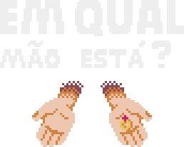
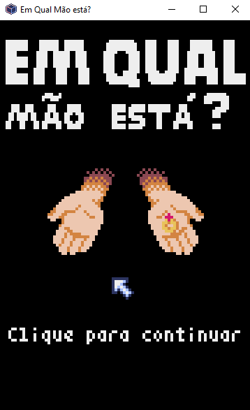

  <h4>🚧⚠️Em desenvolvimento...⚠️🚧</h4>

  <h3>Sobre o projeto</h3>
  
Criado através da linguagem python, com objetivo de começar um projeto do mais simples possível, o "Em Qual Mão Está?" é um game com jogabilidade simples que utiliza a interface gráfica e cálculos matemáticos do módulo pyxel para brincar com valores aleatórios.

  

    
    
  

  <h3>Resultado</h3>
  

    
    
  

